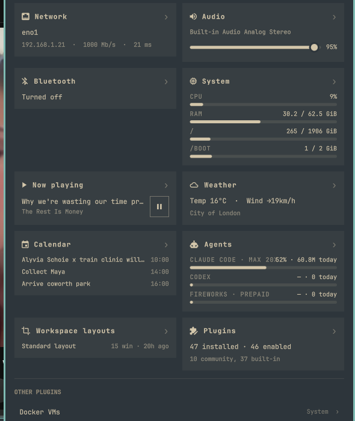

# OmarchyInfo

One dropdown with everything your bar knows.

A control-center-style panel for the [Omarchy](https://omarchy.org) status bar:
click a single icon (or press a keybinding) and get an at-a-glance view of
network, audio, bluetooth, battery, CPU/RAM/disk, docker containers and media
playback — plus a quick-access row for every other bar plugin you have
installed, opening its real popout with one click.



## Why

A bar full of community plugins means a row of tiny icons, and remembering
which one to click for which information. OmarchyInfo aggregates it the way
a phone's control center does: swipe down (well, click once), see everything.

## Install

```bash
omarchy plugin add https://github.com/YOUR-GITHUB/omarchy-info
omarchy plugin enable marco.omarchy-info --section right
```

Plugins land disabled so you can read the code first — that's Omarchy policy,
and a good one.

## Keybinding

The panel is IPC-addressable out of the box. To toggle it from anywhere, add
to `~/.config/hypr/bindings.lua`:

```lua
o.bind("SUPER + I", "OmarchyInfo", "omarchy-shell shell toggle marco.omarchy-info")
```

Inside the open panel: `Esc` closes, `Tab`/`Shift-Tab` switches to the
neighbouring plugin popouts, `r` forces a refresh.

## Cards

| Card | Source | Extras |
|---|---|---|
| Network | `omarchy-network-status` | click header → full network popout |
| Audio | Pipewire (live) | working volume slider; right-click mute |
| Bluetooth | BlueZ (live) | connected device names |
| Battery | UPower (live) | hides itself on desktops |
| System | own `bin/omarchy-info-stats` | CPU, RAM, per-disk bars |
| Docker | `docker ps` | hides itself when docker is absent |
| Now playing | Omarchy media service | working play/pause |

Card headers with a `›` open the corresponding plugin's full popout.

## Other plugins

Below the cards, every bar plugin that isn't already covered by a card gets a
row that opens its popout. Only widgets actually placed in your bar and
actually offering a popout are listed — no dead clicks.

## Settings

Configure via the bar's widget settings UI, or inline in
`~/.config/omarchy/shell.json`:

| Key | Default | Meaning |
|---|---|---|
| `cards` | `[]` (= all) | which cards to show |
| `showOtherPlugins` | `true` | list uncovered bar plugins |
| `refreshIntervalSec` | `3` | polling cadence while open (stats/docker/network) |
| `panelWidthPx` | `560` | dropdown width |
| `columns` | `2` | card grid columns (1–3) |

Command-driven cards only poll while the panel is open; live cards (audio,
battery, bluetooth, media) are event-driven and cost nothing.

## Development

Files under `~/.config/omarchy/plugins/` hot-reload on save. If a code change
doesn't seem to apply to an already-loaded widget, `omarchy restart shell`
reloads it for sure. Logic lives in `Model.js`, kept free of QML types so it
runs under node:

```bash
node --test tests/model.test.js
omarchy plugin validate ~/.config/omarchy/plugins/marco.omarchy-info
```

## License

MIT
